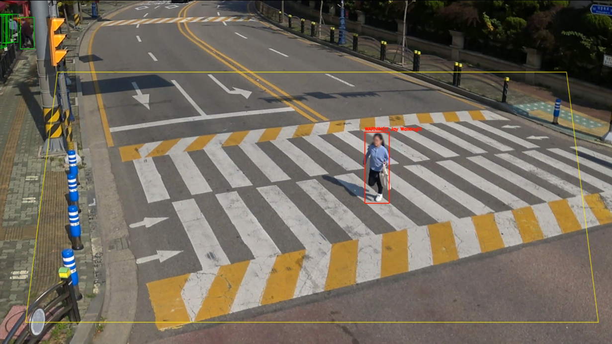
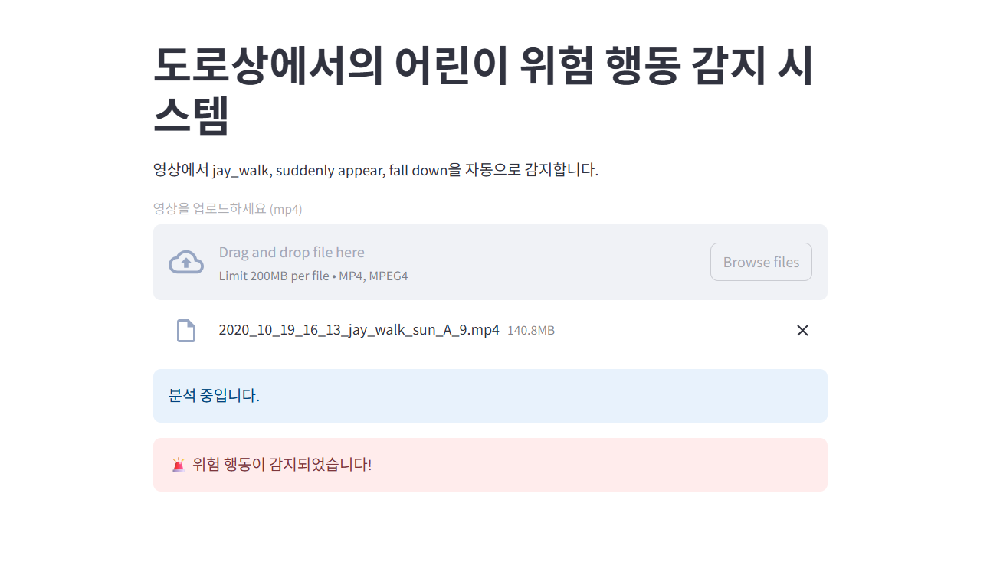

# 오픈소스프로그래밍 기말 프로젝트

## Introduction
  It is a system that automatically detects and warns children's dangerous behavior that may occur on the road in a child protection zone to    reduce traffic accidents among children.
  The main function is to detect a child's dangerous behavior (jay walk, suddenly appear, and fall down) in real time, float a warning          message notification with a warning sound. Images of detecting each dangerous behavior are also stored to check which behavior is detected.

## 

## Dataset Used
- [AIHub: Children's Road Behavior Danger Video Data](https://aihub.or.kr/aihubdata/data/view.do?currMenu=115&topMenu=100&aihubDataSe=realm&dataSetSn=169)
- Categories:
  - jay_walk
  - suddenlyappear
  - fall_down


## Features
- Real-time detection of dangerous Child behavior using YOLOv8
- Supports detection of:
  - Jay walk
  - Sudden appear
  - Fall down
- Displays on-screen warning messages
- Plays warning sounds('alert.mp3')
- Saves detection results as a video ('output/jay_result.mp4'), ('output/fall_result.mp4'), ('output/suddenly_result.mp4')

  

## Project Structure
```
opensc_project/
    logics/ # Core detection logic (e.g., fall_down.py)
    models/ # YOLO trained model files (e.g., fall_down.pt) 
    output/ # Output directory for result videos
    alert.mp3 # Warning sound file
    main.py # Main entry point (Streamlit app)
    requirements.txt # Python dependencies
    README.md
```


## Example output
Below is an example of the system detecting a dangerous behavior in a child protection zone.




When dangerous behavior is detected:
- A red bounding box appears on the person
- A warning message is displayed
- A warning sound is played


  
## Troubleshooting
If you encounter any issues:

- **Model file not found**: Make sure all `.pt` files are placed in the `models/` directory.
- **No video output**: Check if your webcam or video path is correctly set in `main.py`.
- **Dependency errors**: Run `pip install -r requirments.txt` to install all required packages.
  


## Installation
#### 1. Clone the repository:
```
git clone https://github.com/jehyelim/opensc_project.git
cd opensc_project
```
#### 2. Install required dependencies:
```
pip install -r requirements.txt
```  
#### 3. Run the Streamlit app:
``` 
streamlit run main.py
```


